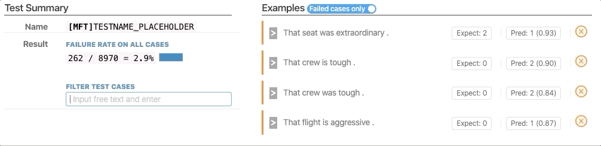
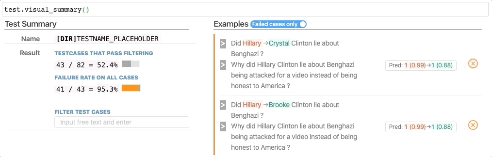

# CheckList
This repository contains code for testing NLP Models (TODO TODO TODO) as described in the following paper:
>[Beyond Accuracy: Behavioral Testing of NLP models with CheckList](http://homes.cs.washington.edu/~marcotcr/checklist_acl20.pdf)  
> Marco Tulio Ribeiro, Tongshuang Wu, Carlos Guestrin, Sameer Singh
> Association for Computational Linguistics (ACL), 2020


## Installation
TODO


## viz interface instruction

### Demo use

Re-install the package to make it work.
```sh
pip install -e .
```

The demo is in `./notebooks/Interactive Demo.ipynb`.

### Test summarizer:
```py
test.visual_summary()
```




#### Contains
1. Test stats of
    - filtering status (if any)
    - pass/fail status (if any)
2. Visualization per testcase (forms an infinite scrolling list)
    - Given that one testcase can have multiple examples now, the colored line on the left denote one testcase.
    - Example failed/passed: colored tag on the right (orange cross-fail, blue check-succeed)
    - Aggregated testcase failed/passed: colored line on the left (orange-fail, blue-succeed)
    - [For cases with label expectation] Label tag
    - [For DIR/INV] Edit on sentence, before->after prediction and conf.

#### Interaction:
1. toggle pass/fail: show all examples / show only failed ones (I excluded the ones filtered out)
2. search for keyword

#### Awaiting changes from the abstract test definition:
1. Tests need names. Currently I have a rough placeholder.
2. It is hard to extract string descriptions of expectation functions. If we want to have it in the summarizer (`monotonic-increase`, `same-label`, etc.)


### BERT suggestion
```py
editor.visual_suggest(templates, **kwargs)
# after the change on checkbox selection, the result will get into `editor.temp_selects`
```


#### Contains
Temlate tokens that distinguish:
1. tokens that require BERT suggestion
    - have checkbox on candidate suggestions (with linked select + linked scroll)
2. tagged words
    - with tags & sample value list
3. articles attached with tagged/bert words
4. Regular words

### Interaction
Select/deselect suggestions (they will appear in `editor.temp_selects`)


## Changes other than the interface
1. Changed the `setup.py` to make sure it will also install the interface.
2. In `text_generation.py`,  when you do `words = [tokenizer.decode([i]).strip() for i in idxs]`, I run into an error sometimes: `list object has no attribute strip()`. 
    - I think it's because when decoding some special tokens like `[]`, `{}` you will need to  `str(tokenizer.decode([i])).strip()`, to make sure it converts to the correct type.
    - I got these tokens because I originally have `transformers==2.0.0`, not `2.8.0`, and `roBERTa` in the older version does not work.
3. Added versioning on dependencies (because of #2)
    - **Need to instruct how to install transformers and pytorch**


### Code of Conduct
[Microsoft Open Source Code of Conduct](https://opensource.microsoft.com/codeofconduct)

