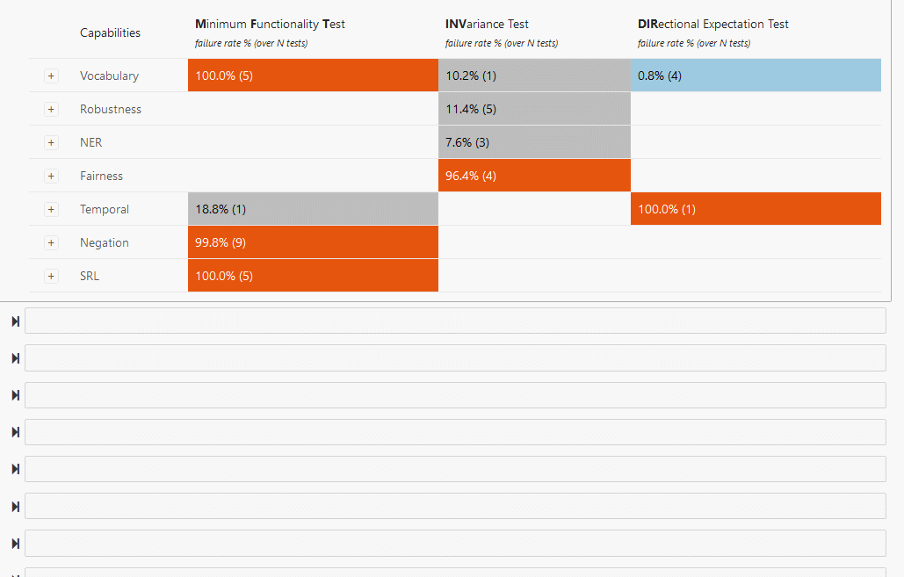

# CheckList
This repository contains code for testing NLP Models as described in the following paper:
>[Beyond Accuracy: Behavioral Testing of NLP models with CheckList](http://homes.cs.washington.edu/~marcotcr/acl20_checklist.pdf)  
> Marco Tulio Ribeiro, Tongshuang Wu, Carlos Guestrin, Sameer Singh
> Association for Computational Linguistics (ACL), 2020

Bibtex for citations:
> @inproceedings{checklist:acl20,  
 author = {Marco Tulio Ribeiro and Tongshuang Wu and Carlos Guestrin and Sameer Singh},  
 title = { Beyond Accuracy: Behavioral Testing of NLP models with CheckList},  
 booktitle = {Association for Computational Linguistics (ACL)},  
 year = {2020}  
}


## Table of Contents
* [CheckList](#checklist)
   * [Table of Contents](#table-of-contents)
   * [Installation](#installation)
   * [Tutorials](#tutorials)
   * [Paper tests](#paper-tests)
      * [Notebooks: how we created the tests in the paper](#notebooks-how-we-created-the-tests-in-the-paper)
      * [Replicating paper tests, or running them with new models](#replicating-paper-tests-or-running-them-with-new-models)
         * [Sentiment Analysis](#sentiment-analysis)
         * [QQP](#qqp)
         * [SQuAD](#squad)
   * [Code snippets](#code-snippets)
      * [Templates](#templates)
      * [RoBERTa suggestions](#roberta-suggestions)
      * [Perturbing data for INVs and DIRs](#perturbing-data-for-invs-and-dirs)
      * [Creating and running tests](#creating-and-running-tests)
      * [Custom expectation functions](#custom-expectation-functions)
      * [Test Suites](#test-suites)
   * [API reference](#api-reference)
   * [Code of Conduct](#code-of-conduct)

## Installation
From pypi:  
```bash
pip install checklist
```
From source:
```bash
git clone git@github.com:marcotcr/checklist.git
cd checklist
pip install -e .
```
Either way, you need to install `pytorch` or `tensorflow` if you want to use masked language model suggestions.
For most tutorials, you also need to download a spacy model:
```bash
python -m spacy download en_core_web_sm
```
## Tutorials

1. [Generating data](notebooks/tutorials/1.%20Generating%20data.ipynb)
2. [Perturbing data](notebooks/tutorials/2.$20Perturbing%20data.ipynb)
3. [Test types, expectation functions, running tests](notebooks/tutorials/3.%20Test%20types,%20expectation%20functions,%20running%20tests.ipynb)
4. [The CheckList process](notebooks/tutorials/4.%20The%20CheckList%20process.ipynb)

## Paper tests
### Notebooks: how we created the tests in the paper
1. [Sentiment analysis](notebooks/Sentiment.ipynb)
2. [QQP](notebooks/QQP.ipynb)
3. [SQuAD](notebooks/SQuAD.ipynb)

### Replicating paper tests, or running them with new models
For all of these, you need to unpack the release data (in the main repo folder after cloning):
```bash
tar xvzf release_data.tar.gz
```
#### Sentiment Analysis
Loading the suite:
```python
import checklist
from checklist.test_suite import TestSuite
suite_path = 'release_data/sentiment/sentiment_suite.pkl'
suite = TestSuite.from_file(suite_path)
```
Running tests with precomputed `bert` predictions (replace `bert` on `pred_path` with `amazon`, `google`, `microsoft`, or `roberta` for others):
```python
pred_path = 'release_data/sentiment/predictions/bert'
suite.run_from_file(pred_path, overwrite=True)
suite.summary() # or suite.visual_summary_table()
```
To test your own model, get predictions for the texts in `release_data/sentiment/tests_n500` and save them in a file where each line has 4 numbers: the prediction (0 for negative, 1 for neutral, 2 for positive) and the prediction probabilities for (negative, neutral, positive).  
Then, update `pred_path` with this file and run the lines above.


#### QQP
```python
import checklist
from checklist.test_suite import TestSuite
suite_path = 'release_data/qqp/qqp_suite.pkl'
suite = TestSuite.from_file(suite_path)
```
Running tests with precomputed `bert` predictions (replace `bert` on `pred_path` with `roberta` if you want):
```python
pred_path = 'release_data/qqp/predictions/bert'
suite.run_from_file(pred_path, overwrite=True, file_format='binary_conf')
suite.visual_summary_table()
```
To test your own model, get predictions for pairs in `release_data/qqp/tests_n500` (format: tsv) and output them in a file where each line has a single number: the probability that the pair is a duplicate.

#### SQuAD
```python
import checklist
from checklist.test_suite import TestSuite
suite_path = 'release_data/squad/squad_suite.pkl'
suite = TestSuite.from_file(suite_path)
```
Running tests with precomputed `bert` predictions:
```python
pred_path = 'release_data/squad/predictions/bert'
suite.run_from_file(pred_path, overwrite=True, file_format='pred_only')
suite.visual_summary_table()
```
To test your own model, get predictions for pairs in `release_data/squad/squad.jsonl` (format: jsonl) or `release_data/squad/squad.json` (format: json, like SQuAD dev) and output them in a file where each line has a single string: the prediction span.

##  Code snippets
### Templates
See [1. Generating data](notebooks/tutorials/1.%20Generating%20data.ipynb) for more details.

```python
import checklist
from checklist.editor import Editor
import numpy as np
editor = Editor()
ret = editor.template('{first_name} is {a:profession} from {country}.',
                       profession=['lawyer', 'doctor', 'accountant'])
np.random.choice(ret.data, 3)
```
> ['Mary is a doctor from Afghanistan.',  
       'Jordan is an accountant from Indonesia.',  
       'Kayla is a lawyer from Sierra Leone.']

### RoBERTa suggestions
See [1. Generating data](notebooks/tutorials/1.%20Generating%20data.ipynb) for more details.  
In template:
```python
ret = editor.template('This is {a:adj} {mask}.',  
                      adj=['good', 'bad', 'great', 'terrible'])
ret.data[:3]
```

> ['This is a good idea.',  
 'This is a good sign.',  
 'This is a good thing.']

Multiple masks:
```python
ret = editor.template('This is {a:adj} {mask} {mask}.',
                      adj=['good', 'bad', 'great', 'terrible'])
ret.data[:3]
```
> ['This is a good history lesson.',  
 'This is a good chess move.',  
 'This is a good news story.']

Getting suggestions rather than filling out templates:
```python
editor.suggest('This is {a:adj} {mask}.',
               adj=['good', 'bad', 'great', 'terrible'])[:5]
```
> ['idea', 'sign', 'thing', 'example', 'start']

Getting suggestions through jupyter visualization:  
```python
editor.visual_suggest('This is {a:mask} movie.')
```


### Perturbing data for INVs and DIRs
See [2.Perturbing data](notebooks/tutorials/2.$20Perturbing%20data.ipynb) for more details.  
Custom perturbation function:
```python
import re
import checklist
from checklist.perturb import Perturb
def replace_john_with_others(x, *args, **kwargs):
    # Returns empty (if John is not present) or list of strings with John replaced by Luke and Mark
    if not re.search(r'\bJohn\b', x):
        return None
    return [re.sub(r'\bJohn\b', n, x) for n in ['Luke', 'Mark']]

dataset = ['John is a man', 'Mary is a woman', 'John is an apostle']
ret = Perturb.perturb(dataset, replace_john_with_others)
ret.data
```
> [['John is a man', 'Luke is a man', 'Mark is a man'],  
 ['John is an apostle', 'Luke is an apostle', 'Mark is an apostle']]

General purpose perturbations (see tutorial for more):
```python
import spacy
nlp = spacy.load('en_core_web_sm')
pdataset = list(nlp.pipe(dataset))
ret = Perturb.perturb(pdataset, Perturb.change_names, n=2)
ret.data
```
> [['John is a man', 'Ian is a man', 'Robert is a man'],  
 ['Mary is a woman', 'Katherine is a woman', 'Alexandra is a woman'],  
 ['John is an apostle', 'Paul is an apostle', 'Gabriel is an apostle']]

```python
ret = Perturb.perturb(pdataset, Perturb.add_negation)
ret.data
```
> [['John is a man', 'John is not a man'],  
 ['Mary is a woman', 'Mary is not a woman'],  
 ['John is an apostle', 'John is not an apostle']]

### Creating and running tests
See [3. Test types, expectation functions, running tests](notebooks/tutorials/3.%20Test%20types,%20expectation%20functions,%20running%20tests.ipynb) for more details.

MFT:
```python
import checklist
from checklist.editor import Editor
from checklist.perturb import Perturb
from checklist.test_types import MFT, INV, DIR
editor = Editor()

t = editor.template('This is {a:adj} {mask}.',  
                      adj=['good', 'great', 'excellent', 'awesome'])
test1 = MFT(t.data, labels=1, name='Simple positives',
           capability='Vocabulary', description='')
```
INV:
```python
dataset = ['This was a very nice movie directed by John Smith.',
           'Mary Keen was brilliant.',
          'I hated everything about this.',
          'This movie was very bad.',
          'I really liked this movie.',
          'just bad.',
          'amazing.',
          ]
t = Perturb.perturb(dataset, Perturb.add_typos)
test2 = INV(**t)
```
DIR:
```python
from checklist.expect import Expect
def add_negative(x):
    phrases = ['Anyway, I thought it was bad.', 'Having said this, I hated it', 'The director should be fired.']
    return ['%s %s' % (x, p) for p in phrases]

t = Perturb.perturb(dataset, add_negative)
monotonic_decreasing = Expect.monotonic(label=1, increasing=False, tolerance=0.1)
test3 = DIR(**t, expect=monotonic_decreasing)
```
Running tests directly:
```python
from checklist.pred_wrapper import PredictorWrapper
# wrapped_pp returns a tuple with (predictions, softmax confidences)
wrapped_pp = PredictorWrapper.wrap_softmax(model.predict_proba)
test.run(wrapped_pp)
```
Running from a file:
```python
# One line per example
test.to_raw_file('/tmp/raw_file.txt')
# each line has prediction probabilities (softmax)
test.run_from_file('/tmp/softmax_preds.txt', file_format='softmax', overwrite=True)
```
Summary of results:
```python
test.summary(n=1)
```
> Test cases:      400  
> Fails (rate):    200 (50.0%)  
>
> Example fails:  
> 0.2 This is a good idea

Visual summary:
```python
test.visual_summary()
```


Saving and loading individual tests:
```python
# save
test.save(path)
# load
test = MFT.from_file(path)
```

### Custom expectation functions
See [3. Test types, expectation functions, running tests](notebooks/tutorials/3.%20Test%20types,%20expectation%20functions,%20running%20tests.ipynb) for more details.

If you are writing a custom expectation functions, it must return a float or bool for each example such that:
- `> 0` (or True) means passed,
- `<= 0` or False means fail, and (optionally) the magnitude of the failure, indicated by distance from 0, e.g. -10 is worse than -1
- `None` means the test does not apply, and this should not be counted

Expectation on a single example:
```python
def high_confidence(x, pred, conf, label=None, meta=None):
    return conf.max() > 0.95
expect_fn = Expect.single(high_confidence)
```

Expectation on pairs of `(orig, new)` examples (for `INV` and `DIR`):
```python
def changed_pred(orig_pred, pred, orig_conf, conf, labels=None, meta=None):
    return pred != orig_pred
expect_fn = Expect.pairwise(changed_pred)
```
There's also `Expect.testcase` and `Expect.test`, amongst many others.  
Check out [expect.py](checklist/expect.py) for more details.


### Test Suites
See [4. The CheckList process](notebooks/tutorials/4.%20The%20CheckList%20process.ipynb) for more details.

Adding tests:
```python
from checklist.test_suite import TestSuite
# assuming test exists:
suite.add(test)
```

Running a suite is the same as running an individual test, either directly or through a file:

```python
from checklist.pred_wrapper import PredictorWrapper
# wrapped_pp returns a tuple with (predictions, softmax confidences)
wrapped_pp = PredictorWrapper.wrap_softmax(model.predict_proba)
suite.run(wrapped_pp)
# or suite.run_from_file, see examples above
```

To visualize results, you can call `suite.summary()` (same as `test.summary`), or `suite.visual_summary_table()`. This is what the latter looks like for BERT on sentiment analysis:
```python
suite.visual_summary_table()
```


Finally, it's easy to save, load, and share a suite:
```python
# save
suite.save(path)
# load
suite = TestSuite.from_file(path)
```

## API reference
On [readthedocs](https://checklist-nlp.readthedocs.io/en/latest/)

## Code of Conduct
[Microsoft Open Source Code of Conduct](https://opensource.microsoft.com/codeofconduct)
